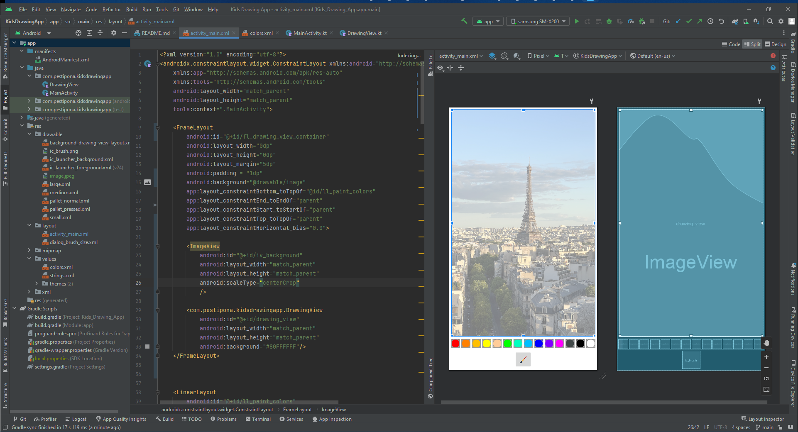

# Android Kids Drawing App

## Classes Used:

* [android.content.Context](https://developer.android.com/reference/android/content/Context)
* [android.graphics.Bitmap](https://developer.android.com/reference/android/graphics/Bitmap)
* [android.graphics.Canvas](https://developer.android.com/reference/android/graphics/Canvas)
* [android.graphics.Color](https://developer.android.com/reference/android/graphics/Color)
* [android.graphics.Paint](https://developer.android.com/reference/android/graphics/Paint)
* [android.graphics.Path](https://developer.android.com/reference/android/graphics/Path)
* [android.util.AttributeSet](https://developer.android.com/reference/android/util/AttributeSet)
* [android.view.View](https://developer.android.com/reference/android/view/View)
* 
* 